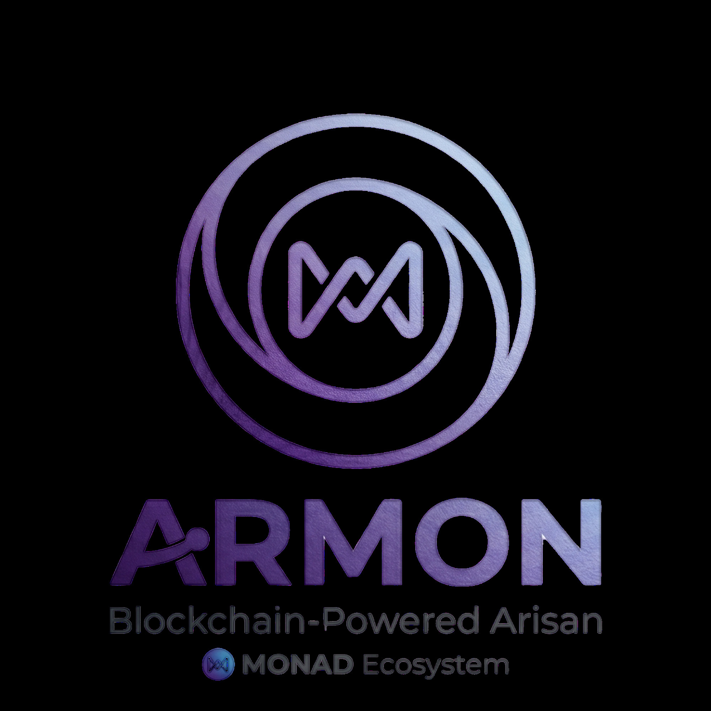

# Armon - Decentralized Arisan on Monad

<p align="center">
  
</p>

> **Arisan tradisional Indonesia, dieksekusi secara trustless di blockchain Monad**

[](https://opensource.org/licenses/MIT)
[](https://reactjs.org/)
[](https://vitejs.dev/)
[](https://soliditylang.org/)

## 🎯 What is Armon?

**Armon** adalah decentralized arisan platform yang menggabungkan budaya arisan tradisional Indonesia dengan teknologi blockchain. Dengan smart contract dan AI-powered yield optimizer, Armon memberikan:

- **Trustless Execution** - Tidak ada intermediary, semua aturan dijalankan oleh smart contract
- **125% Collateral Security** - Deposit collateral 125% dari iuran untuk keamanan pool
- **AI Yield Optimization** - AI secara otomatis mencari yield tertinggi di ekosistem Monad DeFi
- **Bilingual Support** - Mendukung Bahasa Indonesia & English

## ✨ Features

### Core Features
| Feature | Description |
|---------|-------------|
| 🏊 **Pool Creation** | Buat arisan pool dengan kustomisasi jumlah peserta, iuran, dan periode |
| 👥 **Participant Management** | Join pool dengan deposit collateral, lacak status pembayaran |
| 🎲 **Winner Selection** | Random draw atau voting system untuk memilih pemenang |
| 💰 **Prize Distribution** | Pemenang klaim hadiah dari total pool |
| 🔄 **Collateral Withdrawal** | Collateral + yield dikembalikan di akhir pool |

### AI Yield Optimizer
- Analisis real-time yield dari 6+ protokol DeFi Monad
- Rekomendasi otomatis berdasarkan risk appetite
- Visualisasi comparison yield dengan historical data

### Security
- **125% Collateral** - Setiap peserta deposit 125% dari iuran bulanan
- **Smart Contract Verified** - Semua transaksi on-chain dan transparan
- **No Middleman** - Trustless execution tanpa intermediary

## 🏆 Tech Stack

| Layer | Technology |
|-------|------------|
| **Frontend** | React 18 + Vite + TailwindCSS |
| **Smart Contract** | Solidity (Foundry) |
| **Blockchain** | Monad Testnet (Chain ID: 10159) |
| **Wallet Integration** | WalletConnect, MetaMask, Coinbase Wallet |
| **AI Engine** | Rule-based yield optimizer dengan mock data |

## 🚀 Quick Start

### Prerequisites
- Node.js 18+
- npm or pnpm
- Wallet (MetaMask / WalletConnect)

### Installation

```bash
# Clone repository
git clone https://github.com/yt2025id-lab/Armon.git
cd Armon

# Install dependencies
npm install

# Start development server
npm run dev
```

Open [http://localhost:5173](http://localhost:5173) to view the app.

### Deploy Smart Contract

```bash
# Compile contracts
forge build

# Deploy to Monad testnet
forge script script/Deploy.s.sol \
  --rpc-url https://testnet-rpc.monad.xyz \
  --private-key YOUR_PRIVATE_KEY
```

## 📁 Project Structure

```
Armon/
├── contracts/                    # Solidity smart contracts
│   └── Armon.sol                # Main arisan contract
├── public/                       # Static assets
│   └── logo.png                  # Armon logo
├── src/
│   ├── assets/                   # Local assets
│   ├── components/               # Reusable React components
│   │   ├── AIChatWidget.tsx      # AI chat assistant
│   │   ├── PoolCard.tsx         # Pool display card
│   │   ├── WalletButton.tsx     # Wallet connection
│   │   └── ui/                  # UI primitives (Button, etc.)
│   ├── config/                   # App configuration
│   │   └── wagmi.ts             # Wallet configuration
│   ├── hooks/                    # Custom React hooks
│   │   ├── useArmon.ts          # Armon blockchain hooks
│   │   ├── useArmonContract.ts  # Contract interaction
│   │   └── useLanguage.ts       # i18n language hook
│   ├── lib/                      # Utilities & config
│   │   ├── abi.ts               # Contract ABI
│   │   ├── armonClient.ts       # Viem client setup
│   │   ├── contracts.ts         # Contract addresses
│   │   ├── i18n.ts              # Translations (ID/EN)
│   │   ├── yieldData.ts         # DeFi yield data
│   │   └── utils.ts             # Helper functions
│   ├── pages/                   # Route pages
│   │   ├── Home.tsx             # Landing page
│   │   ├── CreatePool.tsx       # Create new pool
│   │   ├── PoolDetail.tsx       # Pool details & actions
│   │   ├── Dashboard.tsx        # User dashboard
│   │   └── YieldOptimizer.tsx   # AI yield optimizer
│   ├── App.tsx                  # Main app component
│   └── main.tsx                 # Entry point
├── SPEC.md                      # Full specification
└── README.md                    # This file
```

## 🔧 How It Works

### 1. Create Pool
Pool owner membuat arisan dengan menentukan:
- Nama pool
- Jumlah iuran bulanan (dalam MON)
- Maksimal peserta (3-50)
- Total periode (1-12 bulan)

### 2. Join Pool
Peserta deposit collateral 125% dari iuran bulanan:
```
Collateral Required = Iuran × 1.25
Example: Iuran 1 MON → Collateral 1.25 MON
```

### 3. Pay Iuran
Peserta bayar iuran bulanan setiap tanggal 1-10. Collateral accrues yield dari protokol DeFi.

### 4. Draw Winner
Di akhir setiap periode:
- **Random Draw**: VRF-based random selection, atau
- **Voting**: Participants vote untuk pilih pemenang

### 5. Claim Prize
Penang klaim hadiah = Total Iuran Pool:
```
Prize = Iuran per Bulan × Jumlah Peserta
Example: 1 MON × 6 peserta = 6 MON hadiah
```

### 6. Withdraw Collateral
Setelah pool selesai atau peserta sudah menang:
```
Withdrawal = Collateral + Yield Accrued
```

## 🤖 AI Yield Optimizer

Armon AI menganalisis yield dari protokol DeFi Monad:

| Protocol | APY | Risk |
|----------|-----|------|
| MonadFi | 12.5% | Low |
| Behoof | 18.2% | Medium |
| K立 | 24.8% | High |
| Magma | 15.0% | Low |
| Bullish | 20.5% | Medium |
| Defi.ai | 28.0% | High |

AI memberikan rekomendasi berdasarkan:
- Risk tolerance (Low / Medium / High)
- Yield optimization strategy
- Historical performance

## 🌐 Live Demo

**Contract Address**: `0x7655E71507e8D114d774A236963418959084C8F2`

**Testnet**: Monad Testnet (Chain ID: 10159)
**RPC**: `https://testnet-rpc.monad.xyz`

## 🧪 Testing

```bash
# Run frontend tests
npm test

# Build for production
npm run build

# Preview production build
npm run preview
```

## 📜 License

MIT License - Built for Monad Blitz Jogja 2026

## 👨‍💻 Team

Armon Team - Winners of Monad Blitz Jogja 2026 🏆

---

<p align="center">
  Made with ❤️ on <strong>Monad</strong>
</p>